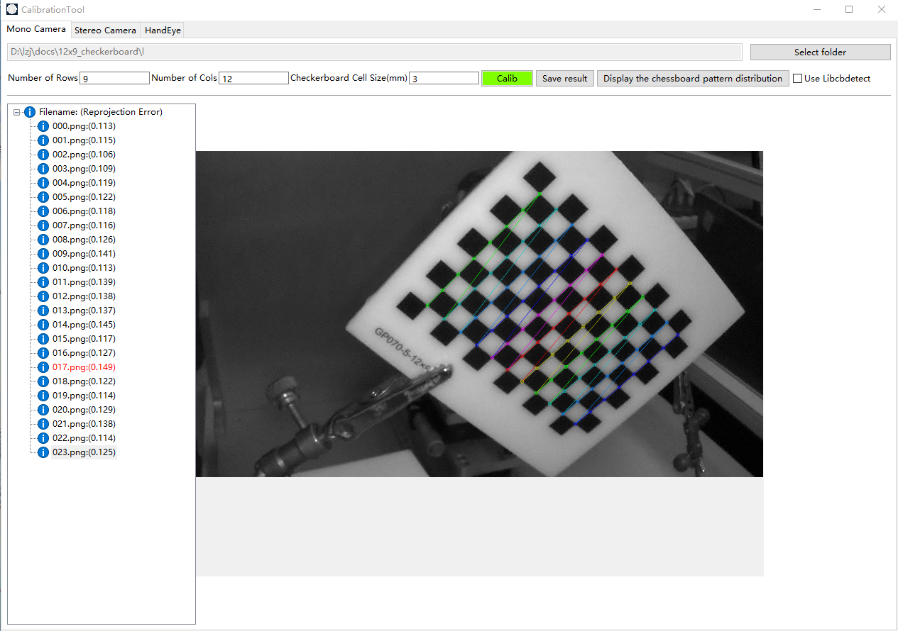
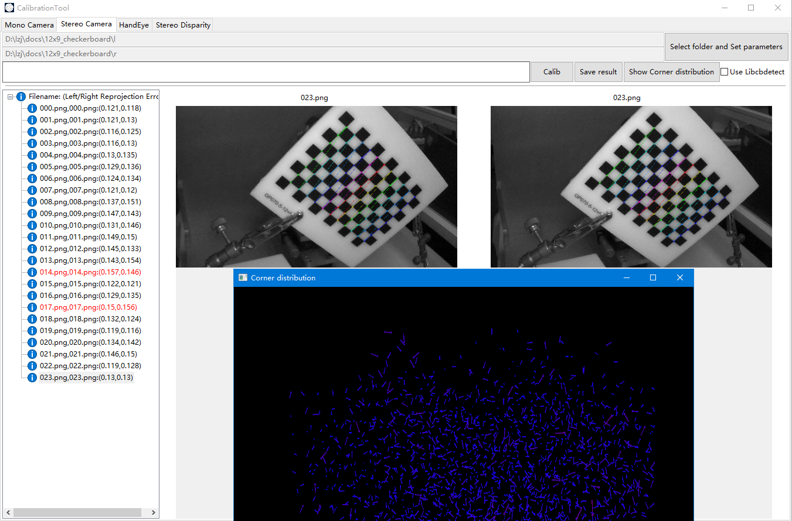
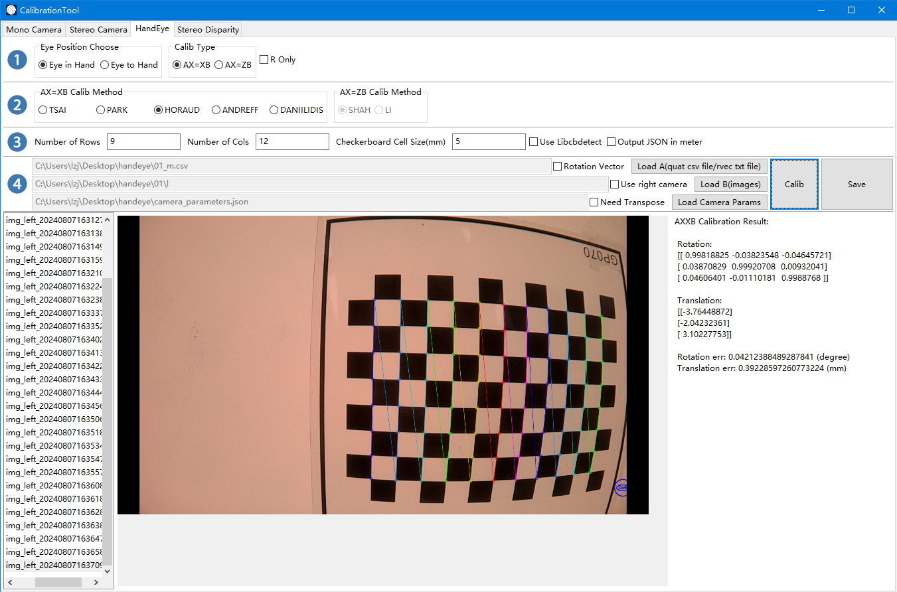
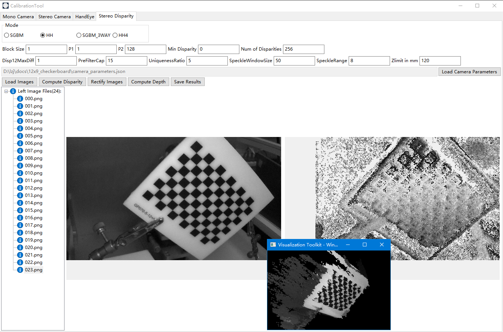

# Camera Calibration Tool on Windows/MacOS
## Support Me
If you want to speedup my progress, please support me.  

## support Mono/Stereo/HandEye calibration and Disparity estimation
  
 
 

## usage
* mono/stereo calibration just see the UI, they are easy to use.  
* handeye should prepare quaternion of tcp in a csv file, the format is below:  

|qw        |qx        |qy        |qz        |tx        |ty        |tz        |
|:---------|:---------|:---------|:---------|:---------|:---------|:---------|
|0.05105444|-0.049133111|0.997192233|0.024228728|-126.2206137|-161.8086994|-1045.676351|
|0.309416| 0.174799| 0.933968| 0.0375692| 81.44089508| 524.9368896| -546.3361816|

## Calibration Pattern
Use [Calib.io](https://calib.io/pages/camera-calibration-pattern-generator) to generate the pattern.
## TODO
- [x]   Support FOV < 80
- [ ]   Support WideAngle (80~110)
- [ ]   Support FishEye and 360
- [x]   Support SGBM/SGM stereo disparity estimation
- [ ]   Support 3D calibration pattern
- [ ]   Support Multi-Cam calibration
- [ ]   Support SFM
- [ ]   Provide easy to use c++ api

## Star History

