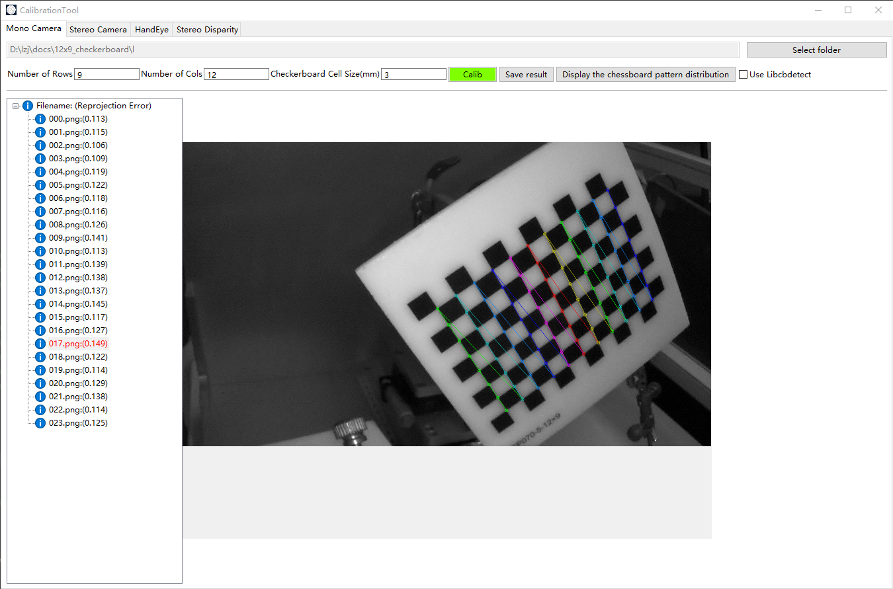

# Camera Calibration Tool on Windows/MacOS
## support Mono/Stereo/HandEye/Disparity calibration
  
 
 

## TODO
- [x]   Support FOV < 80
- [ ]   Support WideAngle (80~110)
- [ ]   Support FishEye and 360
- [x]   Support SGBM/SGM stereo disparity estimation
- [ ]   Support SFM